## Points

### Chapter 1

- Four sources of packet delay
    - d~nodal~ = d~proc~ + d~queue~ + d~prop~ + d~trans~
    - d~trans~ : packet transmission delay = time needed to transmit L-bit packet into link
        - L(bits)/R(bits/sec)
    - d~queue~ : Time waiting at output link for transfer (in buffer)
    - d~proc~ : nodal processing, check bit errors, determine output link
    - d~prop~ : propagation delay. d:length of physical link, s:propagation speed
    d~prop~ = d/s
    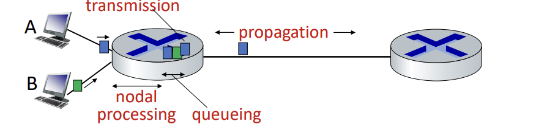

- Packet queueing dealy
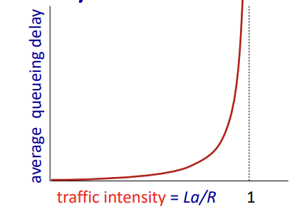
    - R: link bandwidth
    - L: packet length
    - a: average packet arrival rate
    - La/R ~ 0 : avg.queueing delay small
    - ->1 avg. queueing delay large
    - >1 more "work" arriving is more than can be serviced - average delay infinite

- Throughput
    - rate at which bits are being sent from sender to receiver
    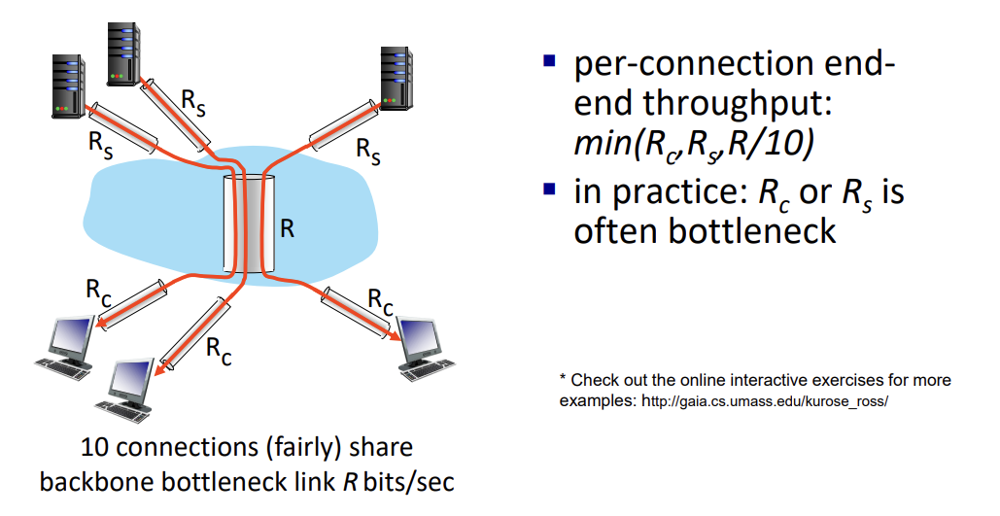

- Two key network-core functions
    - routing: determines source-destination route taken by packets
    - **forwarding: move packets from router's input to appropriate router output(Q)**

### Application layer
- Internet transport protocols services
    - TCP
        - connection-oriented: set up required between client and server process
        - reliable transport: to deliver all data sent with out error and in the proper order
        - **flow control: sender won't overwhelm receiver**
        - congestion control: throttle sender when network overloaded
        - does not provide: timing, minimum throughpu guarantee, security
    - UDP
        - connectionless: there is no handshaking before the two processes start to communicate
        - unreliable data transfer
        - does not provide: reliability, flow control, congestion control, timing, throughput guarantee, security, or connection setup.
        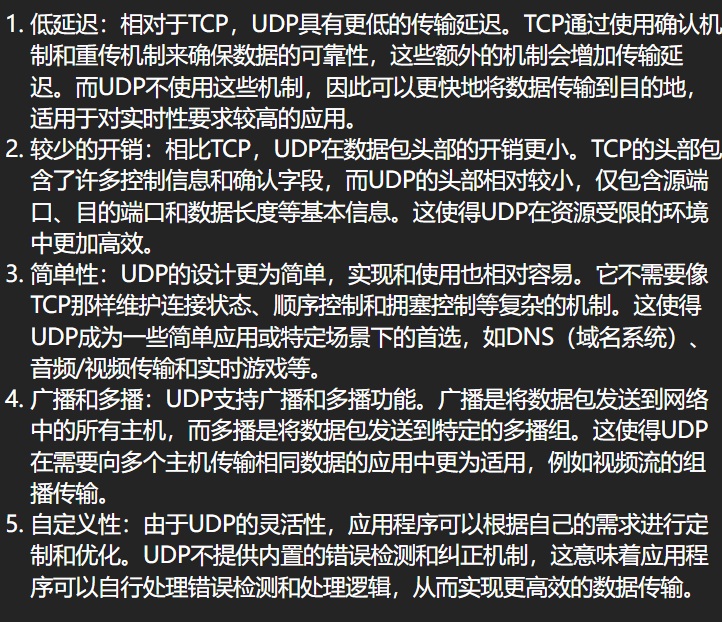

- Electronic mail
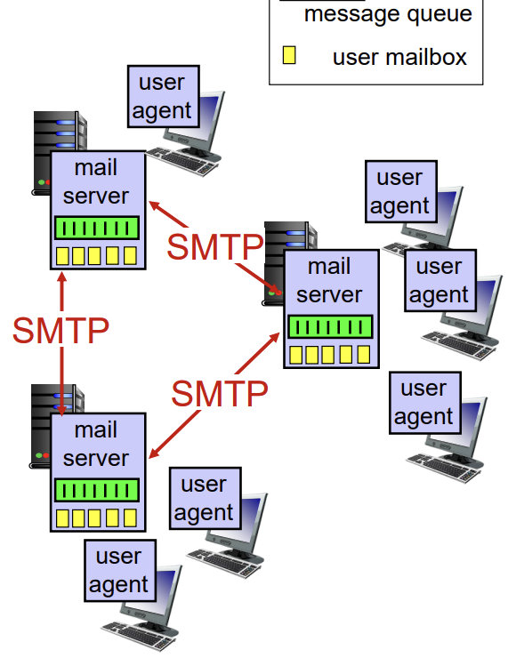
    - Three major components
        - user agents
        - mail servers
            - mailbox contains incoming messages for user
            - message queue of outgoing mail messages
        - **simple mail transfer protocol: SMTP**
            - A protocol used to send and reveice email messages between mail servers
            - SMTP uses TCP as its **underlying** transport protocol to provide the reliable data transfer service
            - Process
                - Client's SMTP mail server estabilishes a TCP connection to the recipients SMTP server using Port25
                - **3 phases of transfer: handshaking, transfer of messages, closure**
                - **messages must be in 7-bit ASCII**
            - Example
            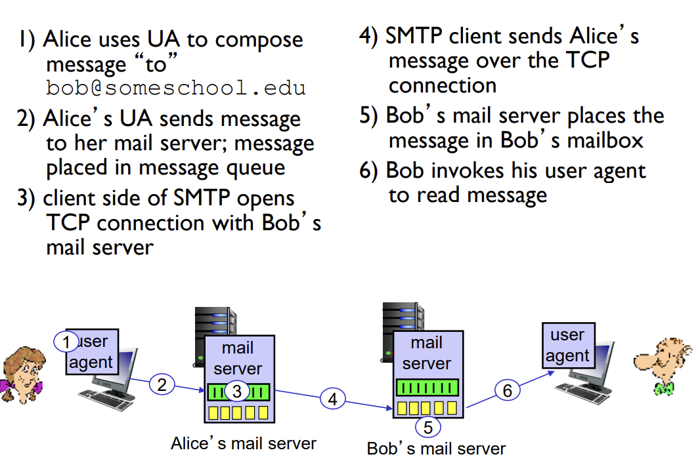
            - SMTP uses persistent connections
                - If the sending mail server has several messages to send to the same receiving mail server, it can send all of the messages over the same TCP connection
            - SMTP server uses CRLF.CRLF to determine end of message
        - Comparison of HTTP and SMTP
        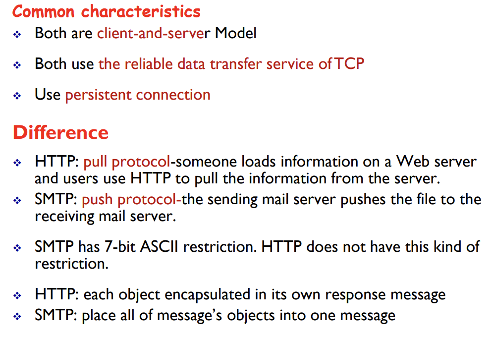

### Transport layer

- Checksum
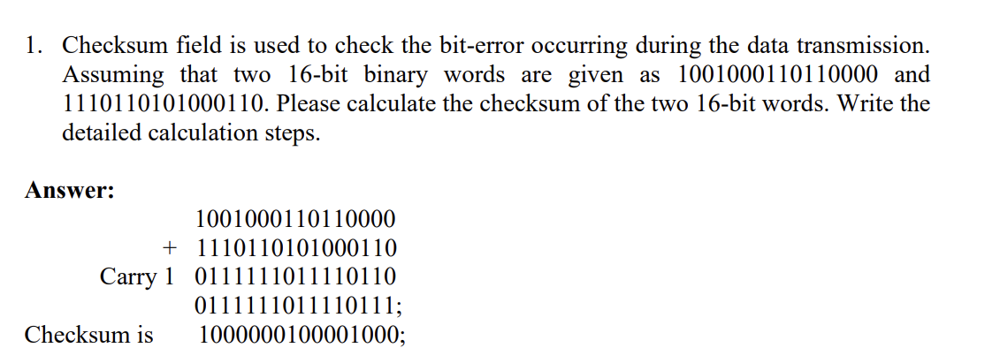

- Sequence Number
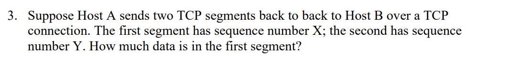
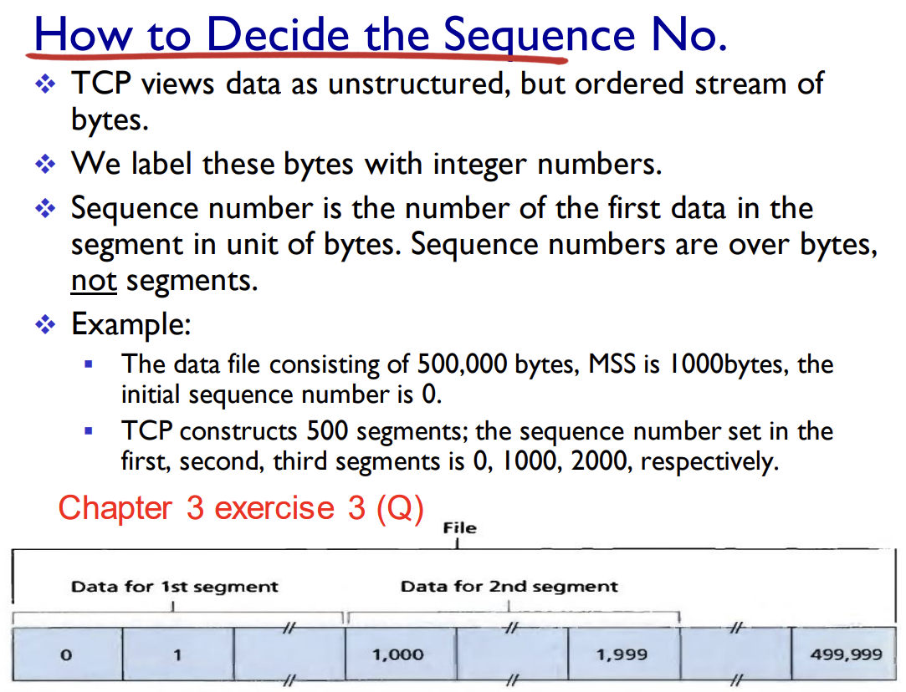
- No 4
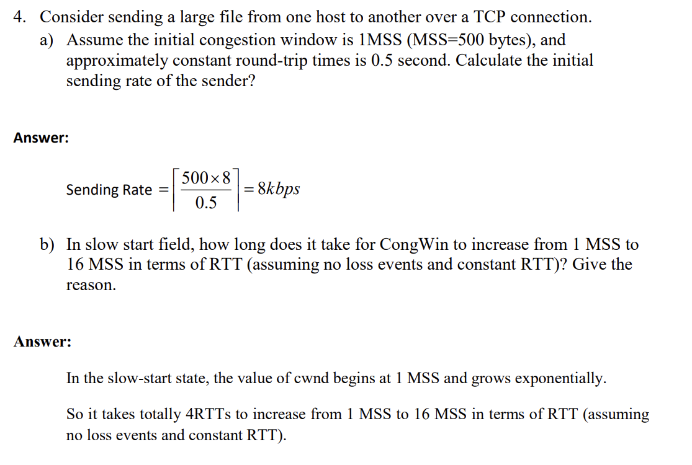
- Datagrams
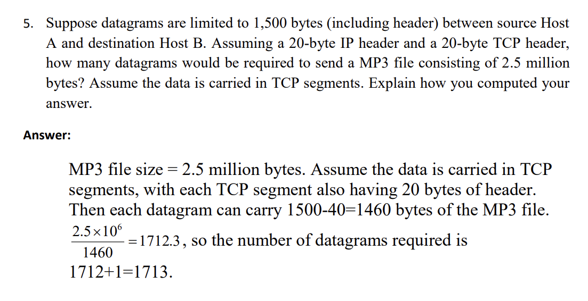

- TCP Congestion Control
    - Congestion window(cwnd): a parameter to limit the transmission rate in sender
        - Sender limits transmission: the amount of unacknowledged data at a sender may not exceed the minimum of cwnd and rwnd
        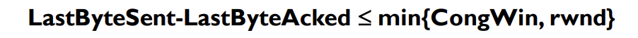
    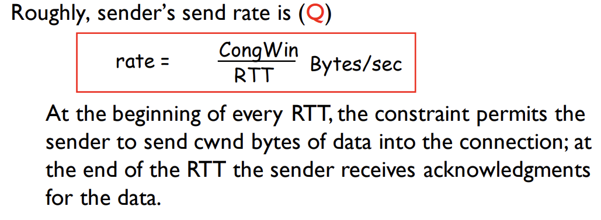

    - Chapter 3, 4(Q), 5(Q)

### Networklayer

- Subnets
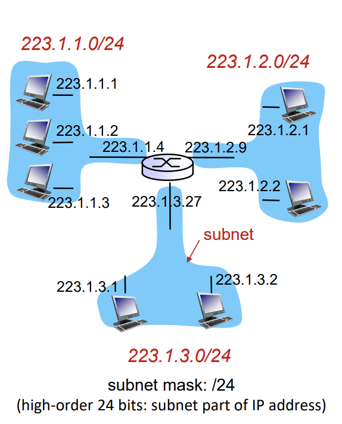
    - A subnet is a network where interfaces can physically reach each other **without passing through an intervenning router**
    - Dotted-decimal notation: a.b.c.d/x, where the notation /x is known as **subnet mask**, it indicate that **x leftmost bits of the 32-bit IP address** is the subnet part, and remaining (32-x) bits is the host part

- Longest prefix matching
    - when looking for forwarding table entry for given adestination address, use longest address prefix that matches destination address
    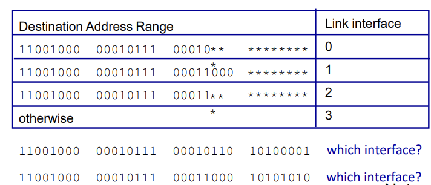

- IP fragmentation & Ressembly
    - Fragmentation
        - Divide a large IP datagram into 22 or more smaller IP datagrames
        - Encapsulate each of these smaller IP datagrams in a separate link-layer frames
        - Send these frames over the outgoing link
        - The process is called as fragmentation, and each of these smaller datagrams is referred to as a fragment
    - Reassembly
        - When these fragments arrive at their destination, the destination ressembles these fragments to reconstruct the original larger size datagram
        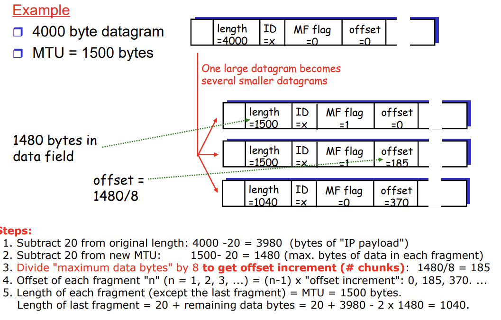
        - MTU means max size 

- Graph abstraction costs
    - Least-cost path: a path with the least cost
    - Shortest path: The path with the smallest number of links
    - If all edges in the graph have the same cosst, the least-cost problem is also the shortest path problem

- Dijkstra's algorithm
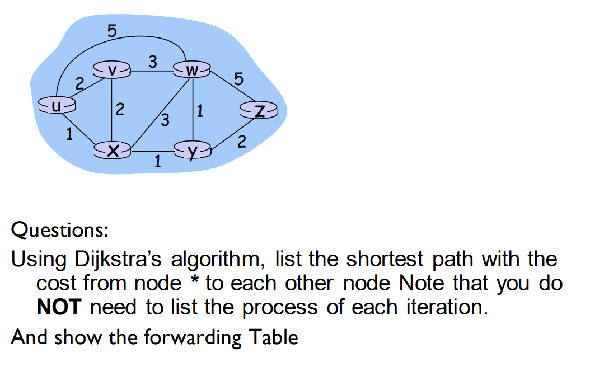
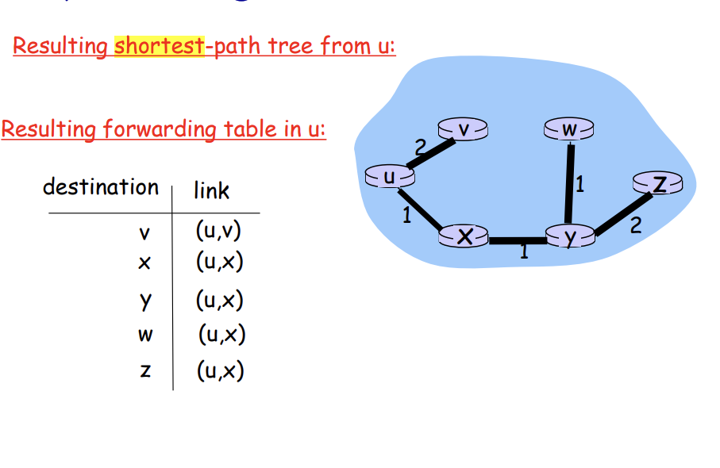

### Link layer

- Multiple access protocols
    - MAC protocol
        - It is designed to coordinate the transmission of different nodes in order to minimize/avoid collission
    - **Goal**
        - Efficient and fair
            - When one node wants to transmit it can send at rate R, where R is the rate of broadcast link
            - When N nodes want to transmit, each can send at average rate R/N
        - Simple
            - Simple and easy to implement
        - decentralized
            - No special node is needed to coordinate transmissions
            - no synchronizzation among all nodes

- Slotted ALOHA
    - Assumptions
        - All frames consist of exactly fixed-size bits
        - time divided into equal size slots
        - If 2 or more nodes transmit in slot, all nodes detect collision
        - nodes are synchronized
    - Operation
        - when node obtains fresh frame, transmits in next slot
            - if no collision: node can send new frame in next slot
            - if collision: node retransmits frame in each subsequent slot with prob. p until success
    
    - Advantages:
        - Single active node can continuously transmit at full rate of channel
        - highly decentralized
            - nodes detect collision independently
            - node decides when to retransmit independently
        - simple
    - Disadvantages
        - collisions, wasting slots
        - idle slots
        - clck synchronization
        - at best , channel used for useful transmissions 37% of time
    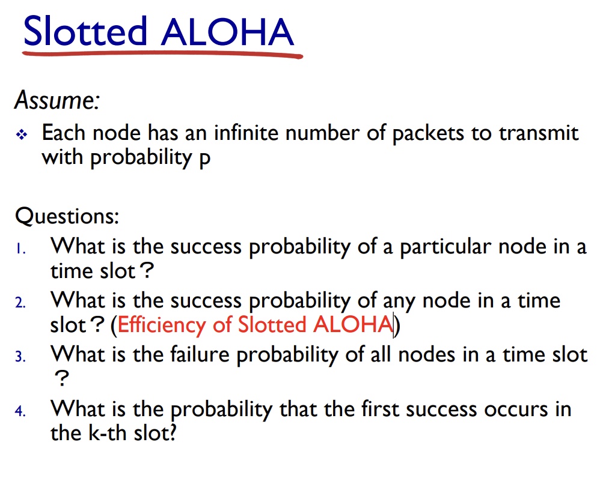
    - Q1: answer: p*(1-p)^(N-1) (N is the total nodes number)
    - Q2: answer: (p*(1-p)^(N-1))^N
    - Q3: answer: 1 - P(success)
    - Q4: answer:  (1 - p)^(k-1) * p

- Switches vs. routers
    - Both are store-and-forward:
        - routers: network-layer devices(examine network-layer headers)
        - switches: link-layer devices(examine link-layer headers)
    - Both have forwarding tables:
        - routers: compute tables using routing algorithms, IP addresses
        - switches: learn forwarding table using flooding, learning, MAC addresses

