# Final Review

### Chapter 1 Overview

- Computer
    - A computer is a machine that can be programmed to carry out sequences of arithmetic or logical operations automatically
    - Software
        - Computer porgramming instructions
    - Components
        - CPU
        - Data and instruction memory(RAM or DRAM)
        - Permanent storage memory (Hard drive)
        - Input/control devices
        - Information output devices
- Turing Machine
    - Abstract components
        - Finite state control, tape, tape head
    - Finite State Control
        - One of a finite number of states at each instant, adn is connected to the tape haed components
        - Two states
            - Accept and reject
    - Tape head
        - Scans one of the tape squares of the tape at each instant, and is connected to the finite state control. It can **read and write** symbols from/onto the tape, and it can move **left and right** along the tape
    - Tape
        - Consists of an infinite number of tape squares, each  of which can store one of a finite number of tape symbols at each instant. The tape is infinite both to the left and to the right. Every other tape square si initialized to a special blank symbol

- **Halting Problem**
- Instruction Cycle
    - Instruction are fetched from memory one at a time
    - The fetched instruction is then excuted by the processor

- Disk Cache
    - A portion of main memory used as a buffer to temporarily hold data for the disk
    - The data are retrieved rapidly from the software cache instead of slowly from disk

- Cache Memory
    - Processor speed is faster than memory speed
    - Increase the speed of meomory

### Chapter2

- Operating System
    - A program that controls the execution of application programs. An interface between applications and hardware
    - 3 Objectives
        - Convenient user, Efficient resource management, Ability to evolve

- Uniprogramming
    - Processor must wait for I/O instruction to complete before preceding
    
    -

- Multiprogramming
    - Running more than one programs at the same time
    - When one job needs to wairt for I/O, the processor can switch to the other job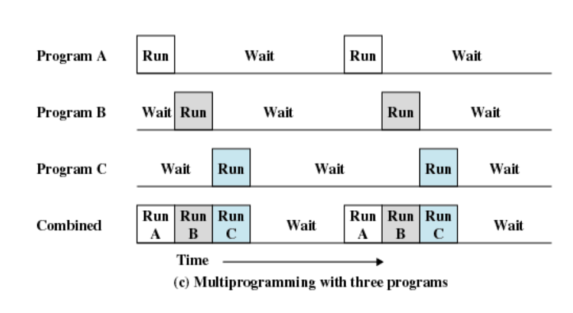

### Chapter 3

- Process
    - An instance of a program running on a computer
    - A unit of activity characterized by the execution of a sequence of instructions, a current state, and an associated set of system instructions
    - Elements
        - Program code, set of data, A number of attributes describing the state of the process
            - Identifier, State, Priority, Program counter, Memory pointers, Context data, I/O state information, Accounting information
        
- Process Management
    - Interleave the execution of several processes
    - Allocate resources to processes
    - Support interprocess communication

- Porcess creation
    - Submission of a batch job
    - User logs on
    - Create to provide a service such as printing
    - Spawned by an existing process

- Process termination
    - Batch job issues Halt instruction
    - User logs off
    - Process executes a service request to terminate
    - Parent may terminate so child processes terminate
    - Operating system intervention
    - Error and fault conditions

- **Dispatcher**
    - A small program that switches the processor from one process to another

- Scheduling
    - Round-robin schedulilng
    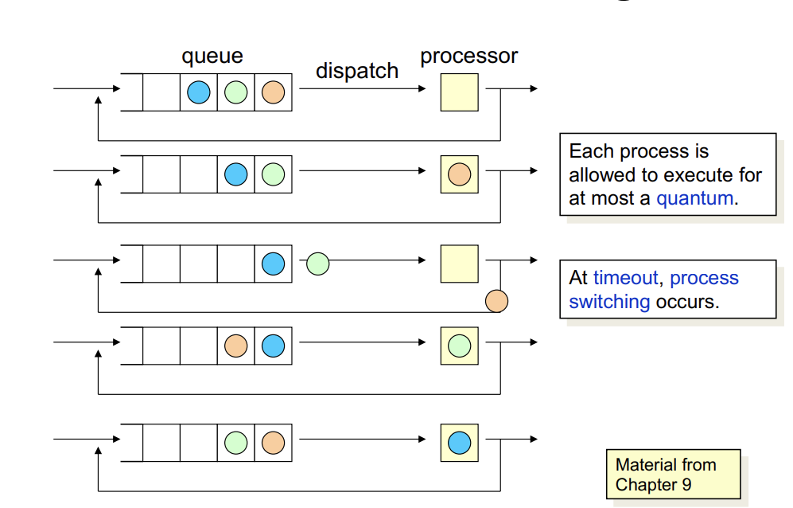
    - When *Timeout* or *I/O, or wait for other envents*, a process cannot continue running and must leave the processor, it is **preempted**
    - Priority Scheduling
        - Each process is assigned a priority
        - When the OS is going to dispatch a process, it chooses a ready process of the highest priority
    
- Suspend Processes
    - Stop the execution of a process **temporarily**
    - Processor is **faster than I/O** so all processes could be waiting for I/O
    - Os may suspend a process that causes a problem
    - Interactive user request
    - Timing: a process that executes periodically
    - Swapping: sometimes OS may swap a blocked process to disk to free up more memory

- Five-state Model
    - Running - being executed by the processor
    - Ready - ready to execute
    - Blocked - cannot execute until some evenet occurs
    - New - created, but not yet admitted'
    - Exit - released
    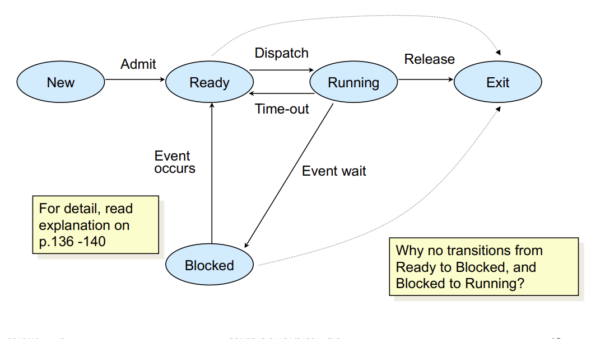
    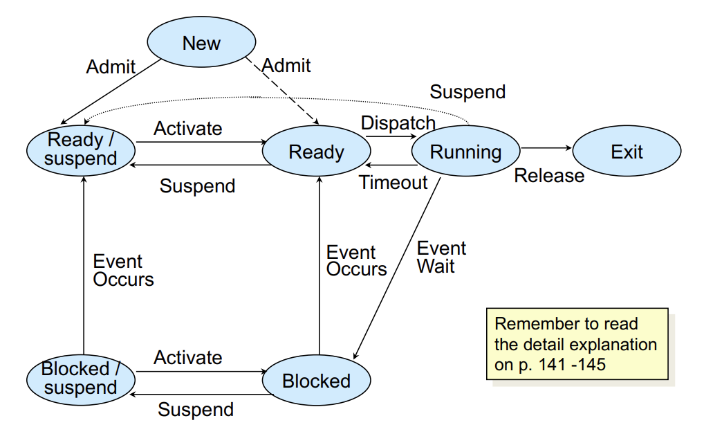

- Process Image
    - Process control bloc(PCB)
        - PCB contains data that the OS needs to control the process
            - Process identification
            - Processor state information
            - Process control information
    - User program
    - User data
    - User stack
    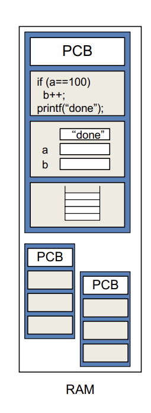

### Chapter4
- Threads and Process
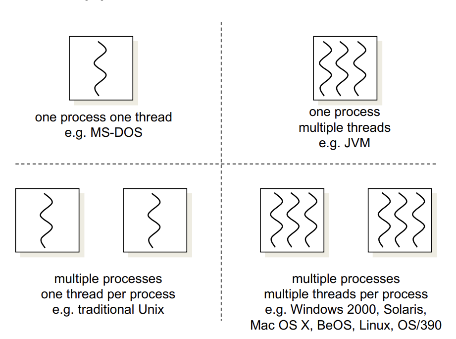

- Multithreaded process model
    - In multithreaded process model, the OS keeps a Thread Control Blok(TCB) for each thread

- Thread
    - Execution states
        - Running, Ready, Blocked
    - Suspending a process involves suspending all threads of the process
        - All threads share the same address space
    - Synchronization
        - It is necessary to synchronize the activities of the various threads
            - Share the same address and affects the other threads
    - User-level Threads (ULTs)
        - All thread management is done by the application
        - The kernel is not aware of the existence of threads
        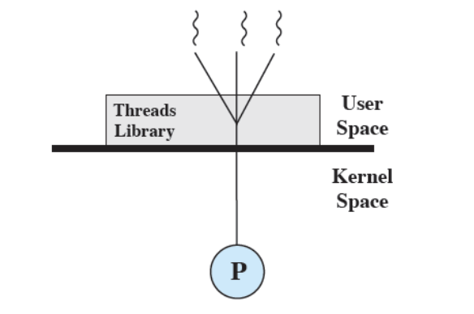
    -Kernel-Level Threads (KLTs)
        - Thread management is done by the kernel
        - No thread mangement is done by the application
        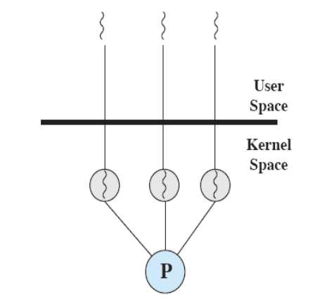
    -Combined
    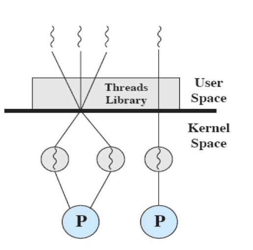
    - Benifits
        - Less time to create/switch/terminate
        - Easier communication

- Summary
    - Process
        - Have a virtual address space which holds the process image
        - Protected access to memory, files, and I/O resources
    - Thread
        - 3 execution states
        - execution stack
        - Thread context is saved and restored in thread switching
        - Has access to the memory and resources of its process

### Chapter5
- Some defination
    - Multithreading - multiple threads within a process
    - Multiprogramming - multiple processes in a uniprocessor system
    - Multiprocessing - multiple processes within a multiprocessor

- Concurrency Key Terms
    - Atomic Operation
        - It is considered as undividable operation, which ensure safe shared resource
    - **Critical Section**
        - Critical section is a section of code within a process that requires to shared resources and which may not be executed while another process in a corresponding section of code
        - The programmer marks the critical sections of the program with some special code. Theses code must ensure that ar most one process/thread can be running inside the critical sections
        - 3 approaches to critical section
            - Software approach, Hardware support, OS support
    - **Deadlock**
        - Permant blocking of a set of processes that compete for system resources
        - 4 necessary conditions: Mutual exclusion, Hold and Wait, No Preemption, Circular Wait
    - Livelock
        - Two or more processes continuously change their states in response to changes in the other process without doing any useful work
    - Mutual Exclusion
        - Only one thread/process is allowed to be in the critical section
    - Race Condition
        -竞态条件（Race Condition）是指在多线程或多进程环境下，对共享资源的访问顺序不确定或不可预测，从而导致程序的行为不一致或不正确的现象
    - Starvation
        - A process can never obtain access to resources it needs

- **Hardware Support**
    - Used internally in OS and device drivers to protect shared kernel data structures
    - 2 methods
        - Interrupt disabling, Spinlock
        - Problems of Interrupt Disabling
            - 通过禁用中断，可以确保某些代码段的执行不会被中断打断，从而提供了一种临时的保护机制
            - Limits the processor's ability to interleave programs
            - Does not work in Multiprocessor
                - disbaling interrupts on one processor does not prohibit other processors to enter CS

- **OS support**
    - The OS provides special functions (API) to protect critical sections and support synchronization

- Busy waiting
    -忙等待（Busy Waiting）是一种在计算机编程中使用的技术，它指的是一个进程或线程在没有其他有用工作可做时，通过循环检查条件来等待某个事件的发生。在忙等待期间，进程或线程会持续地检查特定的条件，直到条件满足为止。

- Problems of busy waiting
    - Consumes processor time
    - May cause starvation
    - May cause deadlock

- **Semaphore**
    - A special integer value with 3 operations
        - initialize to a non-negative value
        - wait -decrements the value. If the value < 0, the thread executing **wait** is blocked
        - signal -increments the value. If the value < 0, then a thread blocked by a **wait** operation is unblocked
        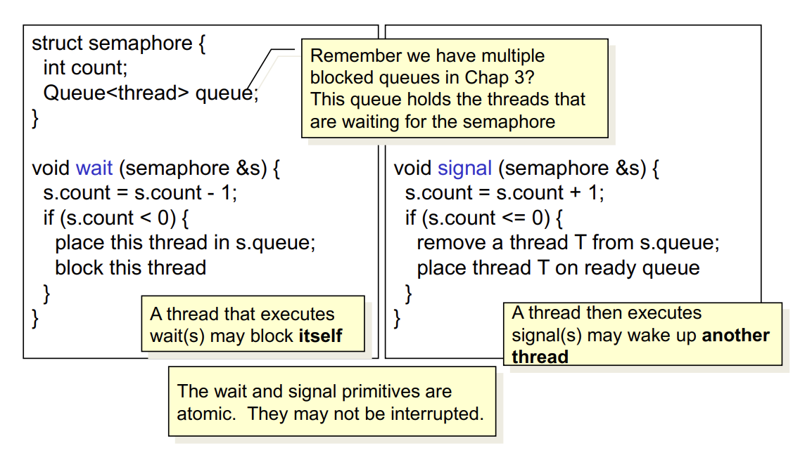
    - How to protect CS
        - Create a shared semaphore S, initialize to 1 enclose the CS in each thread by wait(s) and signal(s)
        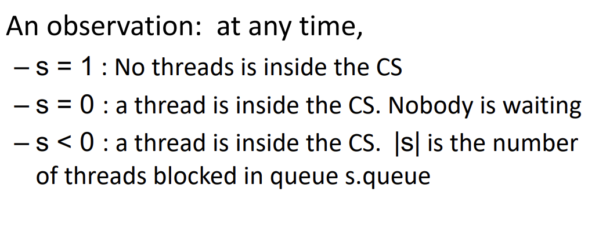
    - Strong semaphores
        - the process that has been blocked the longest is release form the queue first
        - The order in which processes are removed from the queue is not specified
    
- **Producer/Consumer Problem**
    - 2 process/threads communicate indirectly through the shared buffer
    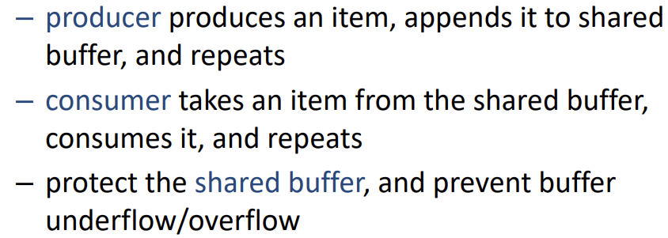
    - Producer has to wait for empty slot(semaphore e)
        - 这边的e表示可使用的位置
    - Consumer has to wairt for available item(semaphore n)
        - 这边的n表示被占用的位置
    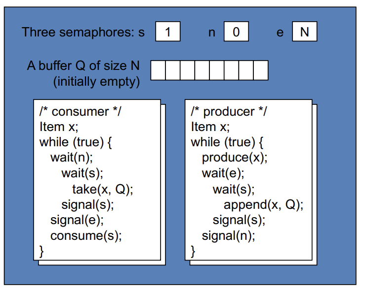

- Monitor
    - Monitor is a software module
        - Local data variables are accessible only by the monitor
        - Process enters monitor by invoking one of its procedures / methods
    
- Readers/Writers Problem
    - Readers read the value of shared data
    - Writers modify shared data
    - When a writer is writing, no readers should read
    - When a reader is reading, no writers should write
    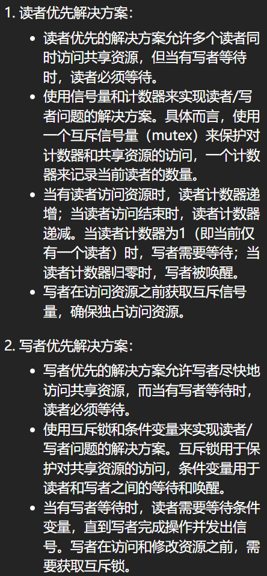
    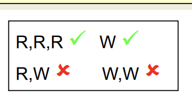
    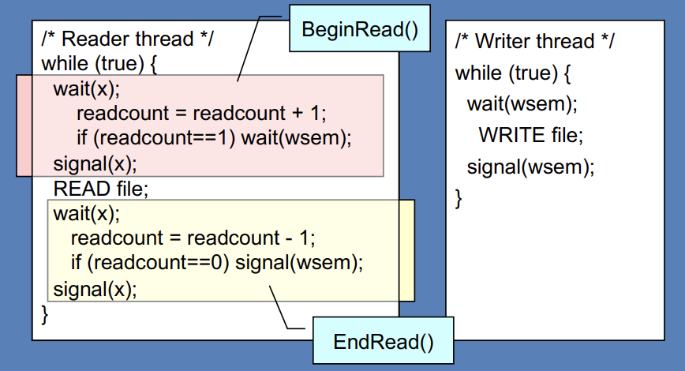
        A single semaphore wsem is used to ensure mutual exclusion of both READs and WRITEs
        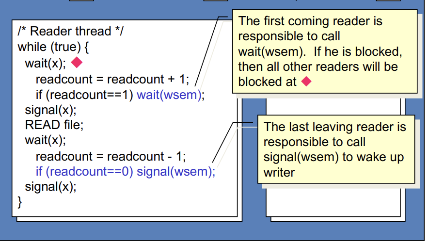
    
- Dining Philosophers Problem
    - Deadlock occurs when there is a circular wait
    - To solve the dining problem
    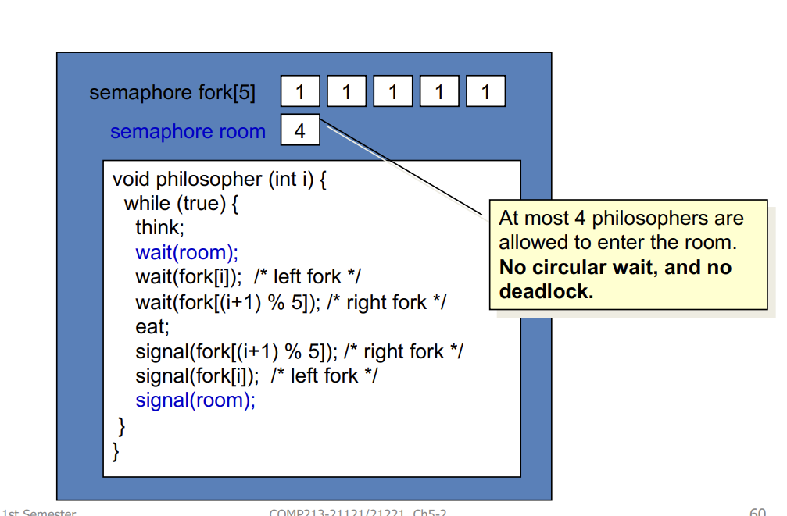

### Chapter 7
- Subdivide memory to accommodate multiple processes
- Memory Management Requirements
    - Relocation
        - When a program is compiled, the address of the code and data are fixed
    - Protection
        - Other processes cannot reference memory of a process without permission
    - Sharing
        - Allow several processes to access the same portion of memory
            - several processes running the same program
            - several processes sharing a common library
            - shared memory for data transfer between processes
    - Logical organization
        - programs are written in modules
    - Physical Organization
        - memory available may be insufficient so we use secondary memory to simulate primary memory

- Fragmentation
    - Fixed Partitioning
        - Partition available memory into regions with fixed boundary
    - Internal fragmentation
    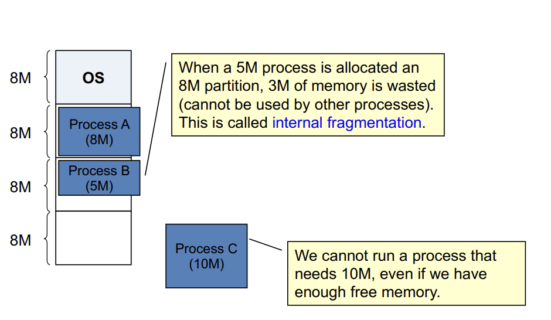
    - Dynamic Partitioning
        - Partitions are of variable length and number
        - Use external fragmentation
        - **Process is allocated exactly as much memory as required**
    - External Fragmentation
    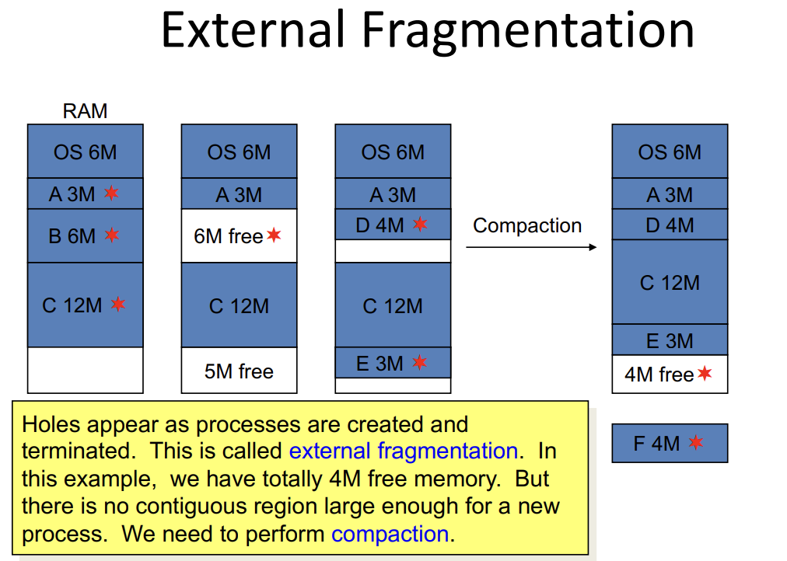

- Placement Algorithm
    - First-fit
        - Starts scanning memory from the beginning and chooses the first available block that is large enough
    - Next-fit
        - Starts scanning memory from the location of the last placement and chooses the next available block that is large enough
    - Best-fit
        - chooses the block that is closest in size to the request
        - worst performer
    
- Physical memory / RAM
    - Each byte in the RAM is identified by a 32 bit physical address
    - Frame
        - The RAM is divided into chunks of equal size. They are called frames
        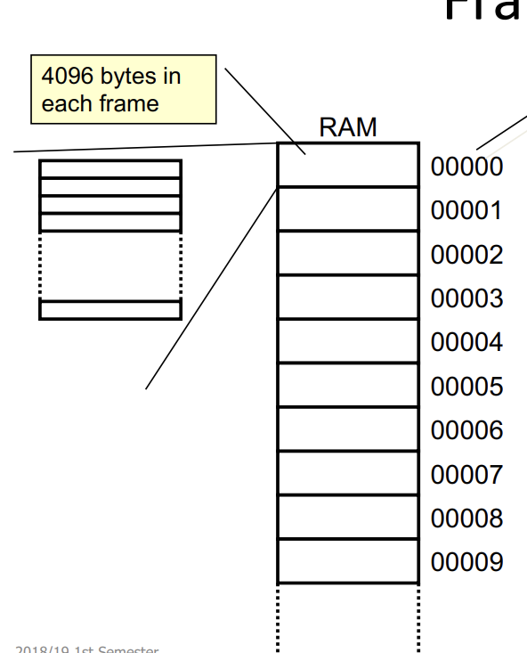
    - Each process has its own 'memory' called addressing space. It is an **illusion** created by the hardware and the OS
    - The addressing space of each process is divided into chunks of equal size called pages
        - The pages in the addressing space of each process are mapped to the frames in the physical memory
        - The OS maintains a data structure called page table to store the mapping between the pages and frames
        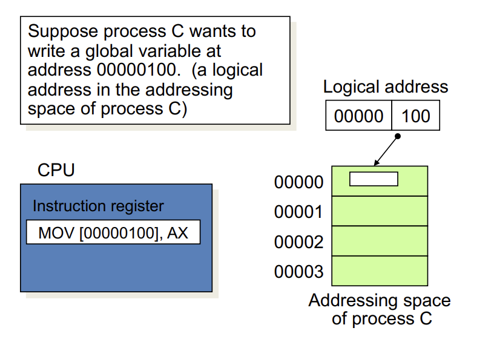
    - **Logical address is the address as seen by a process. The process does not know where in the RAM the byte actually resides in**
    - **Physical address is the address actually used by the CPU to read the physical memory. It is the actual address of the byte in RAM**

- Segments
    - The addressing space of a process is divided into parts of unequal length called segments.
    - The segments are mapped to the RAM through a segment table. It marks the base address and length of the segment
    - Combined Paging and Segmentation
    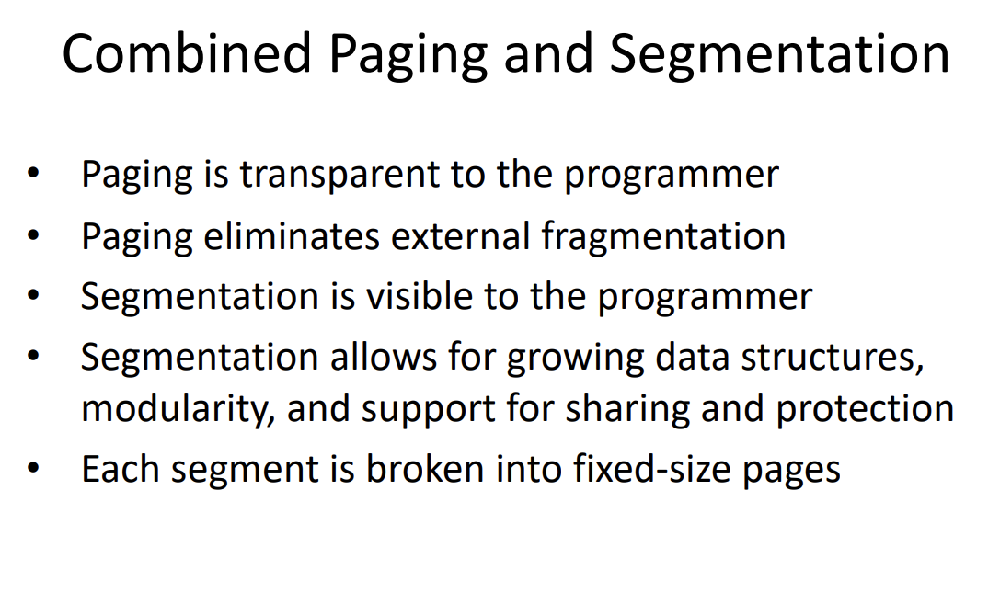
        
### Chapter 8
- Virtual memory
    - "Simulate more RAM using hard disk space"
    - The program/data used by a process do not have to be present in the RAM all the time. Pages not currently used are swapped out to disk

- How the vm works?
    - When the OS find there is not enough memory in RAM, some unnecessary frame may be moved to hard disk.
    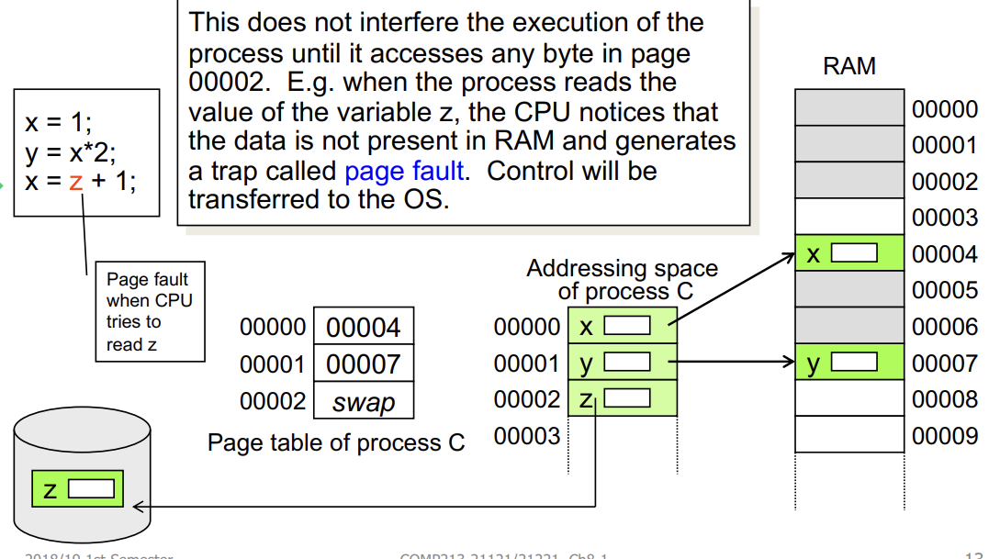
    - When process want to access the frame
    - A page fault occurs when a reference memory address is not present in RAM
    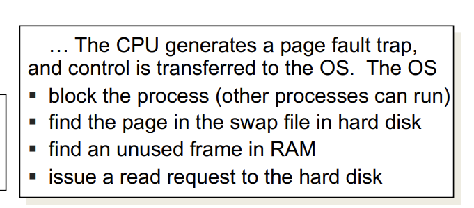
    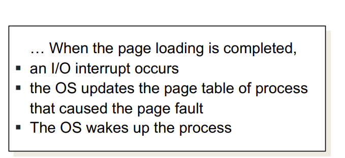
    - The state changes in Page Fault Handling is Running - blocked - ready

- Efficiency
    - Since the hard disk I/O is slow, it causes *thrashing*
        - Thrashing is a state in which the system spends most of its time swapping pieces rather than excuting instructions
    -  To avoid thrashing, the OS tries to guess (based on recent history) which pieces are least likely to be used in the near future.
    - Principle of Locality
        - 它指的是程序在任何给定时间倾向于访问其地址空间或内存的相对较小部分的观察结果。
        - Temporal locality – tendency to access data that are accessed recently
        - Spatial locality – tendency to access data near data that are recently accessed

- Hardware support
    - Page Table Entry
        - Page table is an array of page table entries
        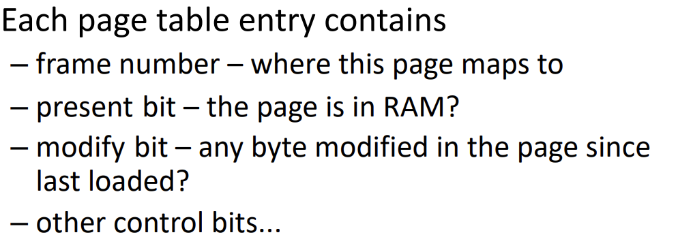
        - **The entire page table may take up too much memory, we can stored it in vitual memory**
    - Present Bit
        - In address translation, the CPU first check the present bit of the page
            - If p = 1, continues, if p = 0, page fault occurs.
    - Modify bit
    - Page Table Pointer
        - A register that holds the starting address of the page table of the running process

- Replacement policy
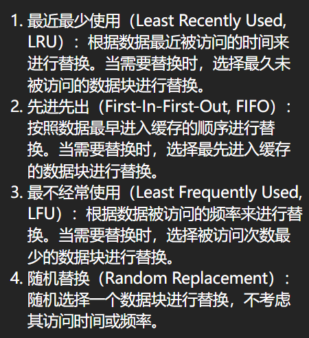
    - Selection of a page in memory to be replaced when a new page is brought in
    - Optimal Policy (Impossible)
    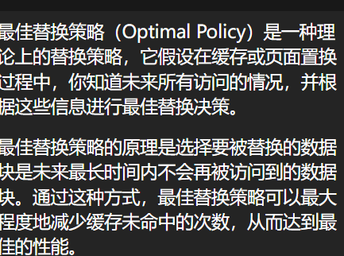
        - Replaced the page for which the time to the next reference is the longest
        - Results in the fewest number of page faults
    - LRU (Difficult)
        - Replaces the page that has not been referenced for the longest time
    - FIFO
        - Replaces the page that has been in memory the longest
    - Clock
        - Needs an additional bit U in PTE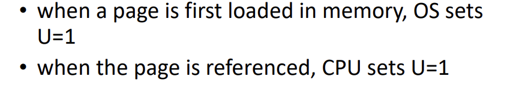
        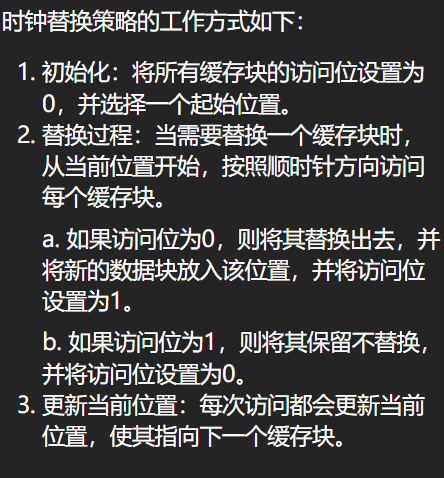
        - Disadvantage
        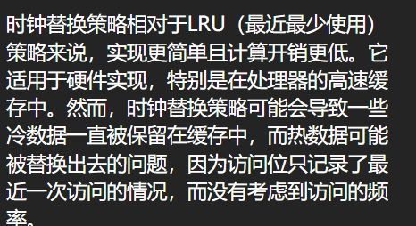
        - Categories of frames using U, M
        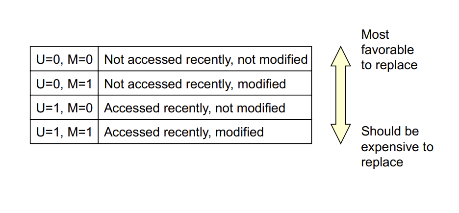
    
- Resident set
    - Portion of process that is in main memory
        - Fixed-allocation, Variable-allocation

### Chapter11
- Perfroming I/O
    - Programmed I/O
        -Process is busy-waiting for the operation to complete
    - Interrupt-driven I/O
        - I/O command is issued
        - Processor continues executing instructions
        - I/O module sends an interrupt when done
    - Direcy Memory Access
        - DMA module controls exchange of data between main memory and the I/O device
    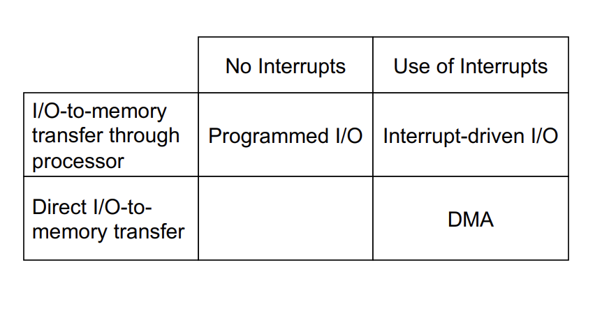

- I/O buffering
    - One buffer
    - Double buffer
        - two buffers are used
    - Circular buffer
        - More than two buffers are used
    
- Disk Shceduling
    - Access time 
        - Total = seek time + rotational dalay + data transfer time
        - Seek time - time required to move the disk arm to the required track
        - Rotational delay - time required to rotate the disk to the required sector
        - Data transfer time - time to read/write data from/to the disk
    
    - FIFO
        - Process requests in the order that the requests are made
    - SSTF
        - select the disk I/O that requieres the least movement of the disk arm from its current position
        - minimum seek time, but may cause starvation
    - SCAN
        - Arm moves in one direction only, satisfying all outstanding requests until there is not more requests **in that direction**. Then reversed
        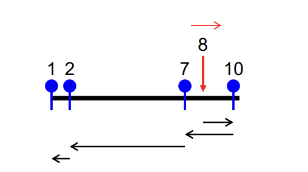
    - C-SCAN
        - restrict scanning to one direction only
        - When the last track has been visited in one direction, the arm is returned to the opposite end of the disk and the scan begins again
    - FSCAN
        - 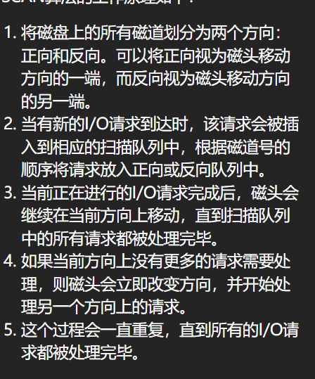

    